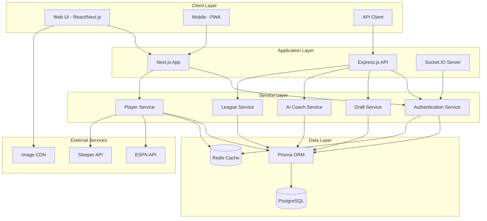
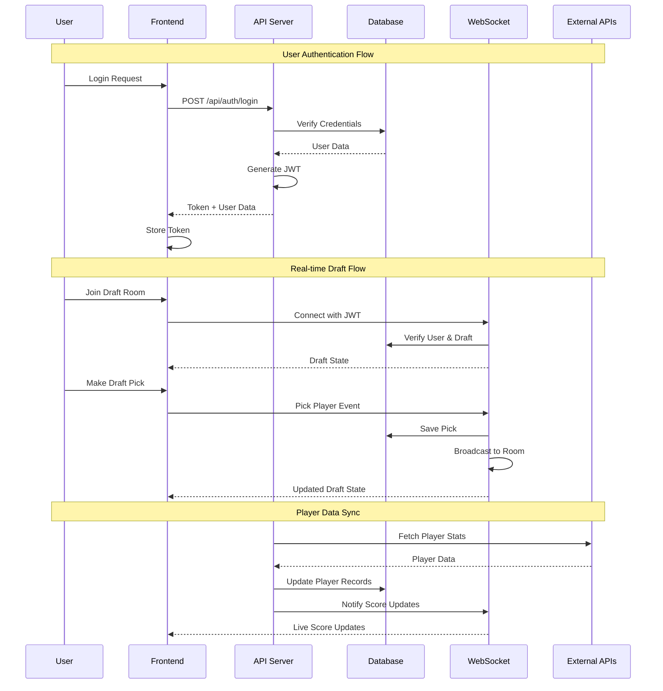
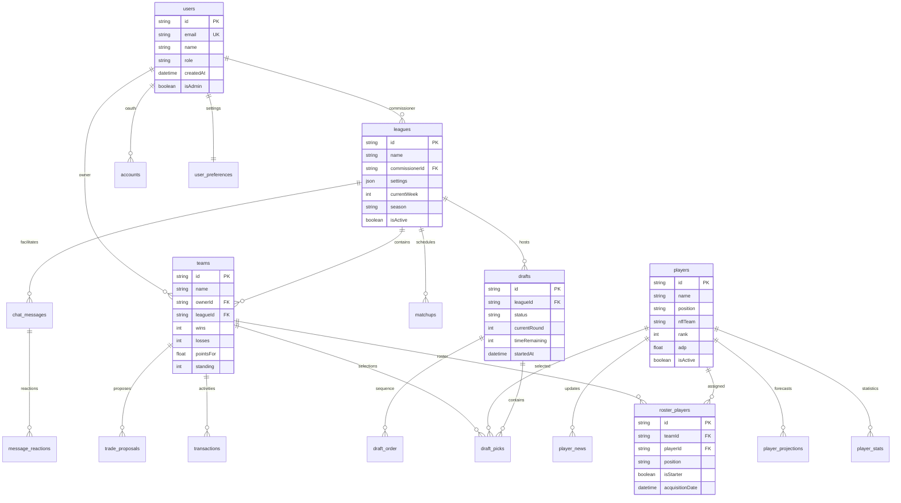
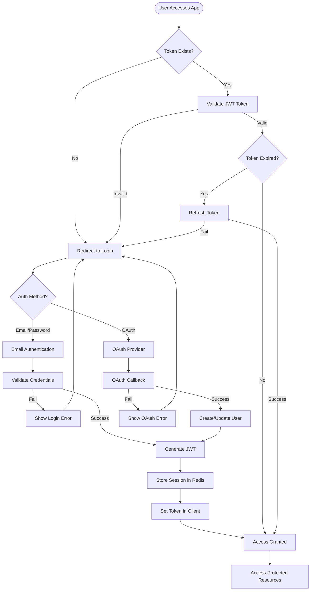
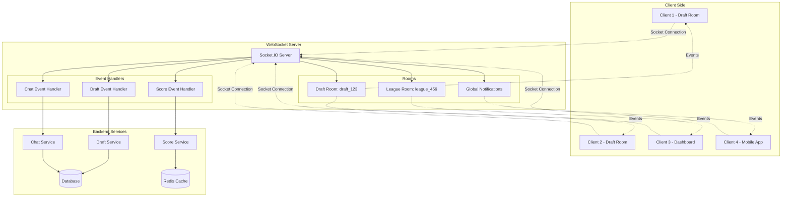
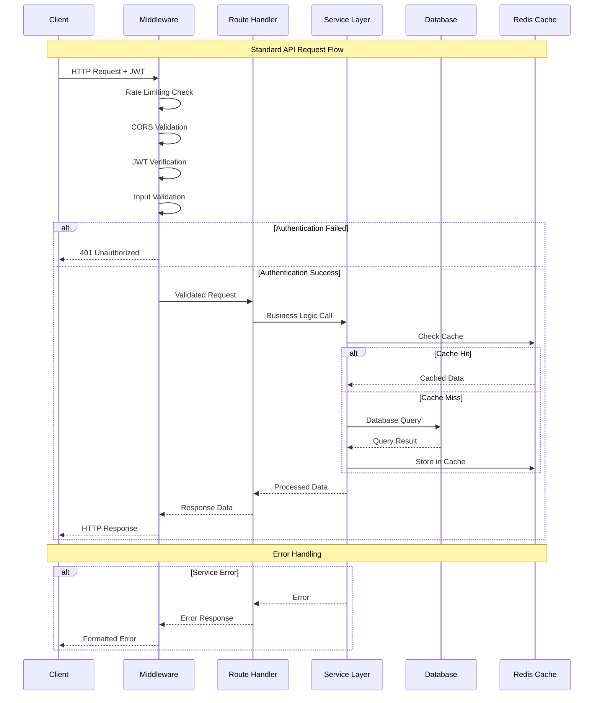
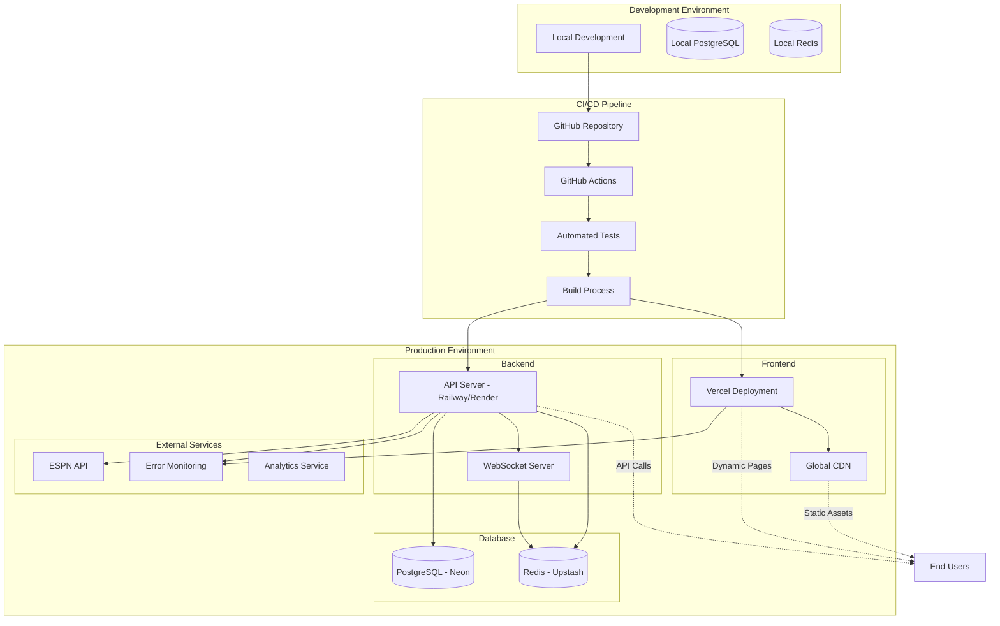
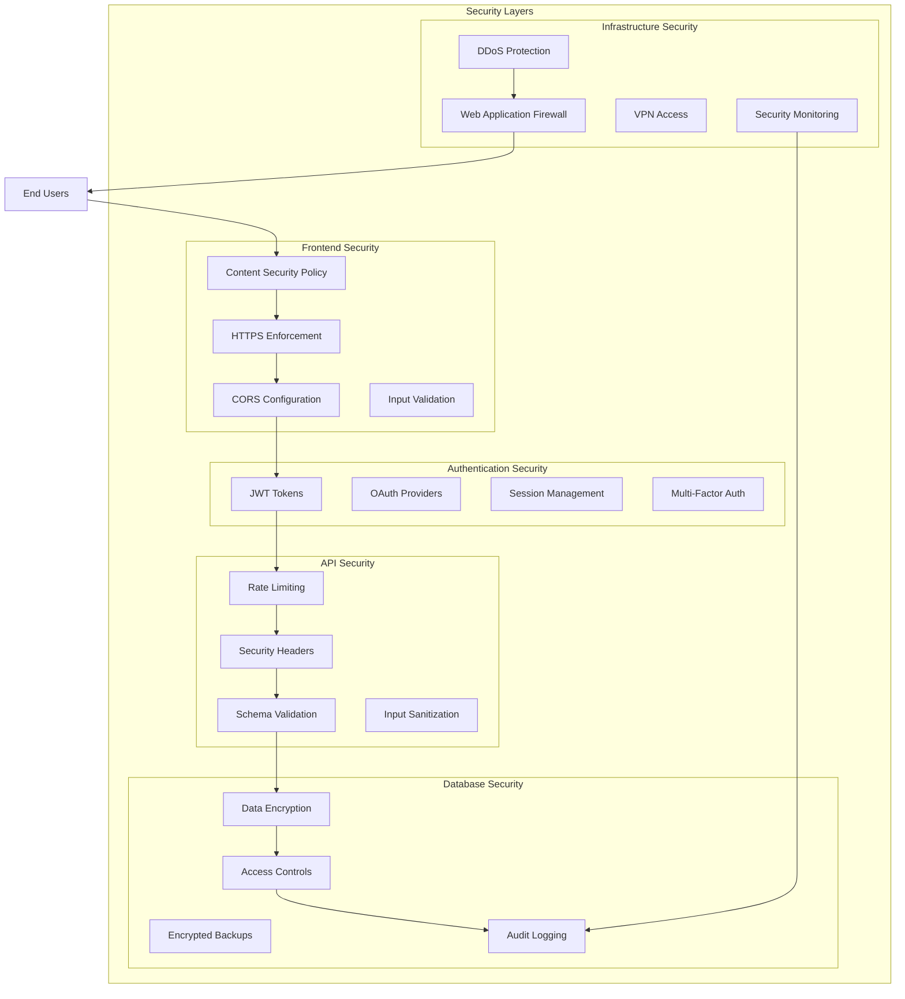
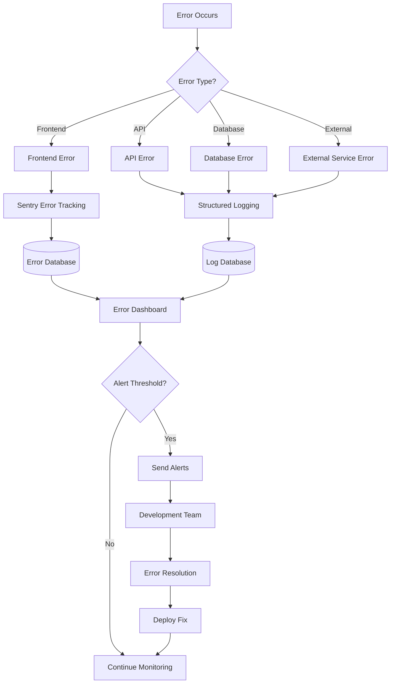

# AstralField v3.0 - System Architecture Diagrams

## Overview

This document contains visual representations of AstralField's system architecture, data flow patterns, and component relationships. These diagrams provide a comprehensive view of how the system operates at various levels.

## High-Level System Architecture



## Detailed Component Architecture

```mermaid
graph TB
    subgraph "Frontend - Next.js Application"
        subgraph "Pages (App Router)"
            Homepage[/ - Landing Page]
            Dashboard[/dashboard - Main Dashboard]
            Draft[/draft - Draft Room]
            Players[/players - Player Database]
            Team[/team - Team Management]
            Auth[/auth - Authentication]
        end
        
        subgraph "Components"
            Layout[Layout Components]
            DraftUI[Draft UI Components]
            PlayerUI[Player Components]
            DashUI[Dashboard Components]
            SharedUI[Shared UI Components]
        end
        
        subgraph "State Management"
            ReactQuery[React Query - Server State]
            Zustand[Zustand - Client State]
            Context[React Context - Global State]
        end
        
        subgraph "Services"
            APIClient[API Client]
            SocketClient[Socket.IO Client]
            AuthClient[Auth Client]
        end
    end
    
    subgraph "Backend - API Services"
        subgraph "Next.js API Routes"
            AuthAPI[/api/auth/* - Authentication]
            SetupAPI[/api/setup/* - Initial Setup]
            DebugAPI[/api/debug/* - Development]
        end
        
        subgraph "Express.js API Server"
            LeagueAPI[/api/leagues/* - League Management]
            PlayerAPI[/api/players/* - Player Data]
            DraftAPI[/api/draft/* - Draft Operations]
            TradeAPI[/api/trades/* - Trading System]
            AIAPI[/api/ai/* - AI Recommendations]
        end
        
        subgraph "WebSocket Services"
            DraftWS[Draft Room Events]
            ChatWS[Real-time Chat]
            ScoreWS[Live Score Updates]
        end
    end
    
    Homepage --> Layout
    Dashboard --> DashUI
    Draft --> DraftUI
    Players --> PlayerUI
    
    DraftUI --> SocketClient
    PlayerUI --> APIClient
    DashUI --> ReactQuery
    
    APIClient --> AuthAPI
    APIClient --> LeagueAPI
    SocketClient --> DraftWS
    
    AuthAPI --> Context
    LeagueAPI --> ReactQuery
    DraftWS --> Zustand
```

## Data Flow Architecture



## Database Entity Relationship Diagram



## Authentication & Authorization Flow



## Real-time Communication Architecture



## API Request/Response Flow



## Deployment Architecture



## Security Architecture



## Performance Optimization Flow

```mermaid
graph LR
    subgraph "Frontend Optimizations"
        CodeSplit[Code Splitting]
        LazyLoad[Lazy Loading]
        ImageOpt[Image Optimization]
        Caching[Browser Caching]
    end
    
    subgraph "API Optimizations"
        APICache[API Response Caching]
        DBIndex[Database Indexing]
        QueryOpt[Query Optimization]
        ConnPool[Connection Pooling]
    end
    
    subgraph "Infrastructure Optimizations"
        CDNOpt[CDN Distribution]
        LoadBalance[Load Balancing]
        Compression[Gzip Compression]
        Monitoring[Performance Monitoring]
    end
    
    Request[User Request] --> CodeSplit
    CodeSplit --> LazyLoad
    LazyLoad --> ImageOpt
    ImageOpt --> Caching
    
    Caching --> APICache
    APICache --> DBIndex
    DBIndex --> QueryOpt
    QueryOpt --> ConnPool
    
    ConnPool --> CDNOpt
    CDNOpt --> LoadBalance
    LoadBalance --> Compression
    Compression --> Response[Optimized Response]
    
    Monitoring --> Performance[Performance Metrics]
```



## Error Handling & Monitoring Flow



---

*These diagrams provide a comprehensive visual representation of AstralField v3.0's architecture, enabling developers and stakeholders to understand the system's design, data flow, and operational characteristics.*