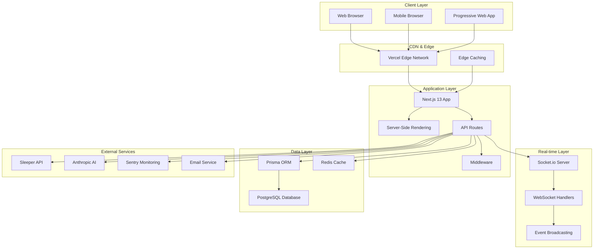
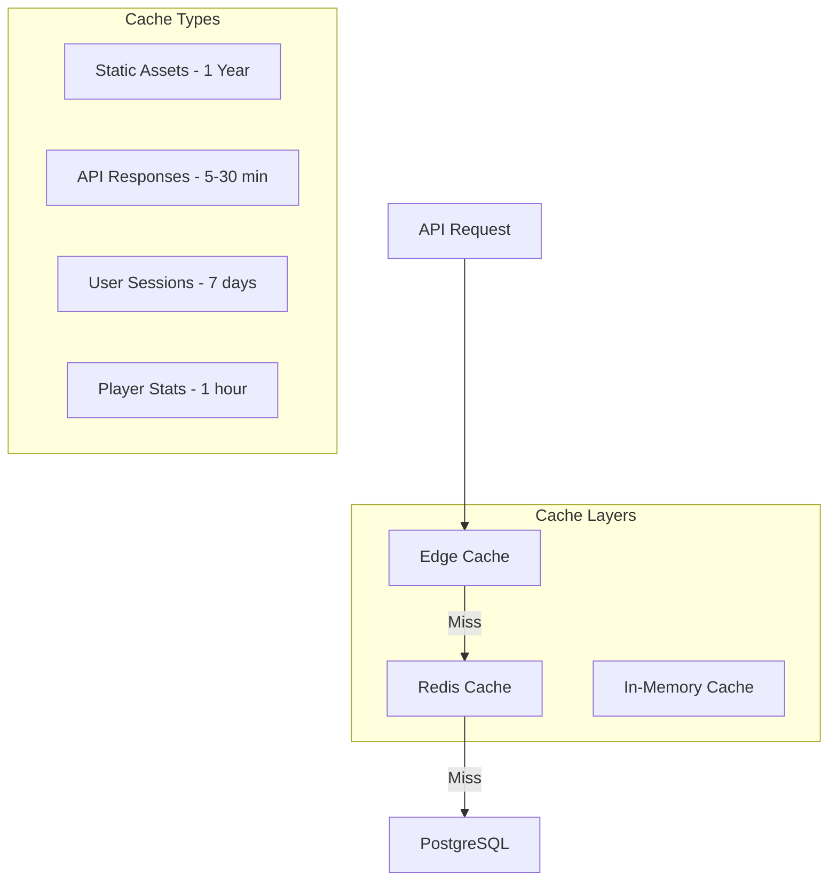
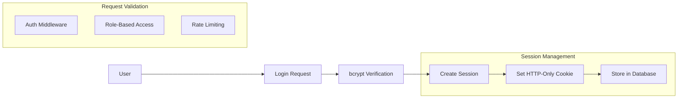
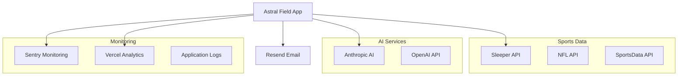
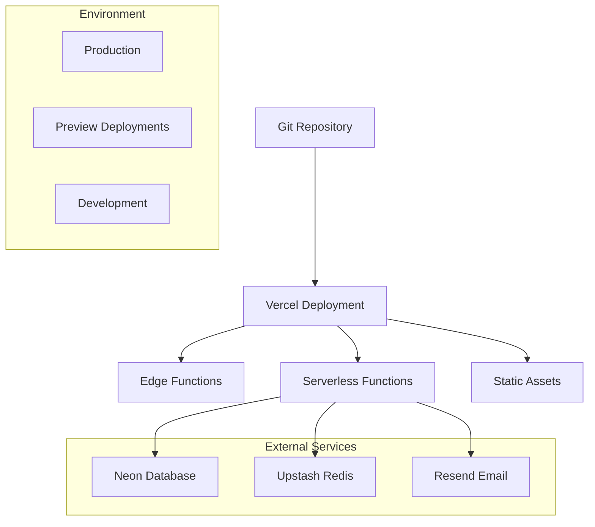

# System Architecture

## Overview

Astral Field V2.1 is built on a modern, scalable architecture using Next.js 13 with the App Router, providing server-side rendering, API routes, and real-time capabilities. The system follows a layered architecture pattern with clear separation of concerns.

## High-Level Architecture



## Core Architecture Principles

### 1. **Serverless-First Design**
- Deployed on Vercel with automatic scaling
- Stateless API functions
- Edge-optimized content delivery
- Cold start optimization

### 2. **Performance-Oriented**
- Advanced caching strategies at multiple layers
- Optimized bundle splitting
- Image optimization and lazy loading
- Database query optimization with indexes

### 3. **Real-time Capabilities**
- Socket.io for live updates
- WebSocket connections for draft rooms
- Server-sent events for notifications
- Optimistic UI updates

### 4. **Scalable Data Layer**
- PostgreSQL with connection pooling
- Redis for session storage and caching
- Prisma ORM with type safety
- Database migrations and seeding

## Component Architecture

### Frontend Layer

```typescript
src/
├── app/                    # Next.js 13 App Router
│   ├── (auth)/            # Route groups
│   ├── api/               # API route handlers
│   ├── globals.css        # Global styles
│   ├── layout.tsx         # Root layout
│   └── page.tsx           # Homepage
├── components/            # Reusable UI components
│   ├── ui/               # Base UI components
│   ├── forms/            # Form components
│   ├── dashboard/        # Dashboard widgets
│   ├── league/           # League management
│   ├── team/             # Team management
│   ├── player/           # Player components
│   ├── trade/            # Trading interface
│   └── draft/            # Draft room components
├── lib/                  # Utility libraries
│   ├── auth.ts          # Authentication logic
│   ├── db.ts            # Database connection
│   ├── utils.ts         # Utility functions
│   └── validations.ts   # Form validation schemas
├── hooks/               # Custom React hooks
├── types/               # TypeScript type definitions
└── styles/              # Styled components and themes
```

### API Layer Architecture

```typescript
src/app/api/
├── auth/                # Authentication endpoints
│   ├── login/
│   ├── logout/
│   └── session/
├── league/              # League management
├── team/                # Team operations
├── player/              # Player data
├── trade/               # Trade functionality
├── draft/               # Draft management
├── waiver/              # Waiver claims
├── analytics/           # Performance analytics
├── chat/                # Real-time messaging
└── webhook/             # External API webhooks
```

## Data Architecture

### Database Schema Overview

The database consists of 25+ interconnected models covering:

#### Core Entities
- **Users** - Authentication and user management
- **Leagues** - League configuration and settings
- **Teams** - Fantasy team ownership and management
- **Players** - NFL player database with stats
- **Roster** - Team rosters and lineup management

#### Transactional Entities
- **Trades** - Trade proposals and executions
- **Waivers** - Waiver claim processing
- **Drafts** - Draft management and picks
- **Matchups** - Head-to-head scoring
- **Transactions** - All league transactions

#### Analytics & Metadata
- **PlayerStats** - Historical and projected statistics
- **Notifications** - User notification system
- **AuditLogs** - System audit trail
- **Sessions** - User session management

### Caching Strategy



## Security Architecture

### Authentication & Authorization



### Security Features
- **Password Security**: bcrypt hashing with salt rounds
- **Session Management**: Database-stored sessions with expiration
- **CSRF Protection**: Built-in Next.js CSRF tokens
- **Rate Limiting**: API endpoint rate limiting
- **Input Validation**: Zod schema validation
- **SQL Injection Prevention**: Prisma ORM parameterized queries

## Integration Architecture

### External Services



### API Integration Patterns
- **Circuit Breaker**: Fault tolerance for external APIs
- **Retry Logic**: Exponential backoff for failed requests
- **Caching**: Aggressive caching of external API responses
- **Rate Limiting**: Respect external API rate limits
- **Error Handling**: Graceful degradation on service failures

## Performance Architecture

### Optimization Strategies

#### Bundle Optimization
```javascript
// next.config.js
const nextConfig = {
  experimental: {
    serverComponentsExternalPackages: ['@prisma/client'],
  },
  webpack: (config) => ({
    ...config,
    optimization: {
      splitChunks: {
        chunks: 'all',
        cacheGroups: {
          vendor: { test: /[\\/]node_modules[\\/]/ },
          react: { test: /[\\/]node_modules[\\/](react|react-dom)[\\/]/ },
          ui: { test: /[\\/]node_modules[\\/](@radix-ui)[\\/]/ }
        }
      }
    }
  })
}
```

#### Database Optimization
- **Connection Pooling**: PgBouncer for connection management
- **Query Optimization**: Strategic indexes and query analysis
- **Read Replicas**: Separate read/write database connections
- **Batch Operations**: Bulk inserts and updates

#### Cache Optimization
- **Edge Caching**: Vercel edge cache for static content
- **API Caching**: Redis for frequently accessed data
- **Application Caching**: React Query for client-side caching
- **Database Caching**: Prisma query result caching

## Real-Time Architecture

### Socket.io Implementation

```typescript
// Real-time event handling
class SocketManager {
  private io: SocketIOServer;
  
  constructor() {
    this.io = new SocketIOServer(server, {
      cors: { origin: process.env.NEXTAUTH_URL },
      transports: ['websocket', 'polling']
    });
    
    this.setupEventHandlers();
  }
  
  private setupEventHandlers() {
    this.io.on('connection', (socket) => {
      socket.on('join-league', (leagueId) => {
        socket.join(`league-${leagueId}`);
      });
      
      socket.on('lineup-update', (data) => {
        this.broadcastToLeague(data.leagueId, 'lineup-changed', data);
      });
    });
  }
}
```

### Real-Time Features
- **Live Scoring**: Real-time score updates during games
- **Draft Rooms**: Live draft with pick notifications
- **Trade Notifications**: Instant trade proposal alerts
- **Chat System**: Real-time league messaging
- **Lineup Changes**: Live lineup update broadcasting

## Deployment Architecture

### Vercel Deployment



### Environment Configuration
- **Production**: Optimized builds with minification
- **Preview**: Feature branch deployments
- **Development**: Local development with hot reload
- **Environment Variables**: Secure configuration management

## Monitoring & Observability

### Monitoring Stack
- **Application Monitoring**: Sentry for error tracking
- **Performance Monitoring**: Vercel Analytics for metrics
- **Database Monitoring**: Neon built-in monitoring
- **Cache Monitoring**: Redis insights and metrics
- **Custom Metrics**: Application-specific performance tracking

### Health Checks
```typescript
// Health check endpoint
export async function GET() {
  const checks = await Promise.allSettled([
    checkDatabase(),
    checkRedis(),
    checkExternalAPIs()
  ]);
  
  return Response.json({
    status: checks.every(c => c.status === 'fulfilled') ? 'healthy' : 'degraded',
    checks: checks.map(formatCheckResult),
    timestamp: new Date().toISOString()
  });
}
```

## Scalability Considerations

### Horizontal Scaling
- **Serverless Functions**: Automatic scaling with Vercel
- **Database Scaling**: Neon autoscaling and read replicas
- **Cache Scaling**: Upstash Redis cluster support
- **CDN Scaling**: Global edge distribution

### Performance Bottlenecks
- **Database Queries**: Query optimization and caching
- **External APIs**: Rate limiting and circuit breakers
- **Memory Usage**: Efficient data structures and garbage collection
- **Bundle Size**: Code splitting and lazy loading

---

This architecture supports the current feature set and provides a foundation for future scaling and feature development.